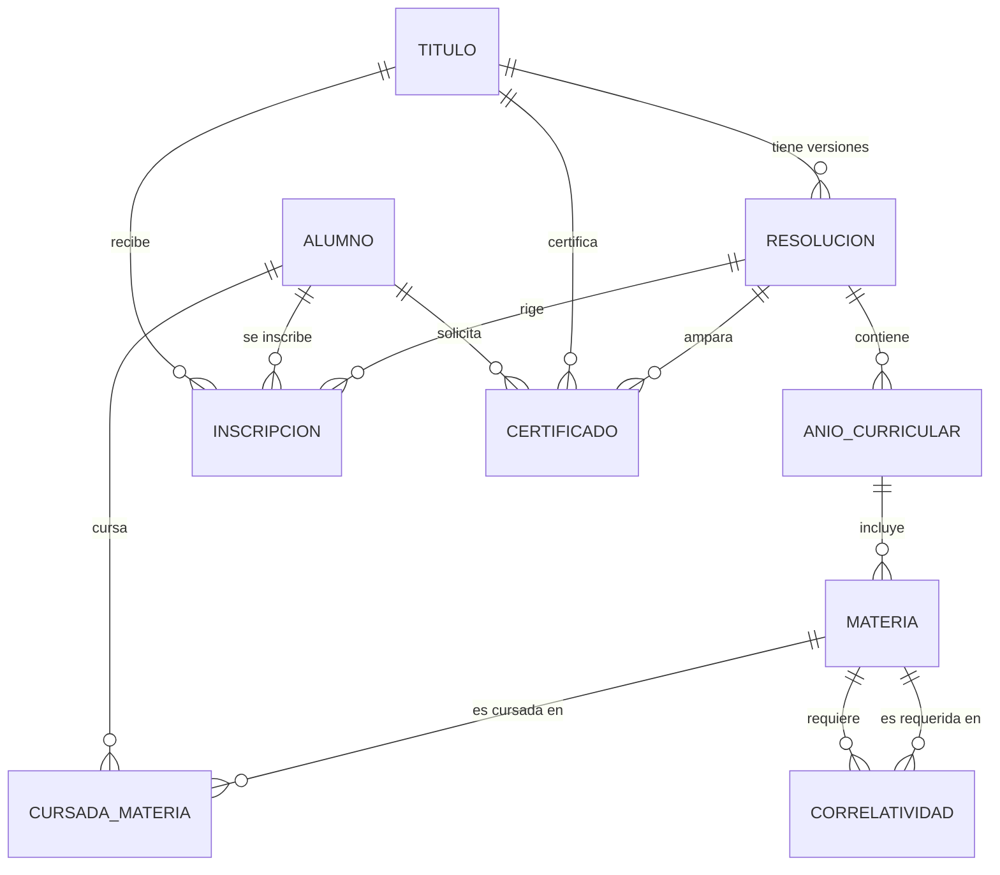

# Plataforma de Gestión de Carreras Académicas

Plan de implementación de una plataforma dockerizada (**Node.js + Express**) para que una institución educativa administre sus **títulos/carreras**, la **currícula** de cada una organizada por años, el control de versiones de esa currícula mediante **resoluciones**, las **correlatividades** entre materias, el seguimiento académico de los alumnos y la emisión de **certificados** (parciales y de título completo).

## Índice

1. [Contexto y objetivo](#1-contexto-y-objetivo)
2. [Glosario de dominio](#2-glosario-de-dominio)
3. [Reglas de negocio clave](#3-reglas-de-negocio-clave)
4. [Modelo de datos](#4-modelo-de-datos)
5. [Diccionario de tablas](#5-diccionario-de-tablas)
6. [Arquitectura técnica](#6-arquitectura-técnica)
7. [Estructura del proyecto](#7-estructura-del-proyecto)
8. [API — Endpoints](#8-api--endpoints)
9. [Flujos principales](#9-flujos-principales)
10. [Docker](#10-docker)
11. [Variables de entorno](#11-variables-de-entorno)
12. [Plan de implementación por fases](#12-plan-de-implementación-por-fases)
13. [Testing y calidad](#13-testing-y-calidad)
14. [Seguridad](#14-seguridad)
15. [Mejoras futuras](#15-mejoras-futuras)

---

## 1. Contexto y objetivo

La institución dicta varios **títulos** (carreras). Cada título tiene una **currícula** (plan de estudios) dividida en **años**, y cada año contiene **materias**. Un alumno aprueba el título cuando aprueba todas las materias de la currícula vigente al momento de su inscripción, respetando las **correlatividades** configuradas entre materias.

Cuando la institución modifica el plan de estudios de un título, no se pisa el plan anterior: se **cierra la resolución vigente** y se **abre una nueva resolución** con las materias actualizadas. Así conviven en el sistema alumnos que cursan bajo distintas resoluciones del mismo título.

El sistema debe permitir:

- Administrar títulos, años, materias y correlativas.
- Versionar la currícula mediante resoluciones (abrir/cerrar).
- Inscribir alumnos y asociarlos a la resolución vigente.
- Registrar el avance académico (cursada, regularidad, aprobación de finales).
- Emitir certificados parciales (por año) y el certificado de título completo.

## 2. Glosario de dominio

| Término | Significado |
|---|---|
| **Título** | Carrera que otorga la institución (ej: "Técnico Superior en Enfermería"). |
| **Resolución** | Código que identifica una versión de la currícula de un título (ej: `RES-045/2023`). Tiene un año de creación y un estado (vigente/cerrada). |
| **Currícula / Plan de estudios** | Conjunto de años y materias que un alumno debe aprobar bajo una resolución determinada. |
| **Año curricular** | Nivel dentro de la carrera (1º, 2º, 3º año, etc.), perteneciente a una resolución específica. |
| **Materia** | Unidad curricular a cursar y aprobar, perteneciente a un año curricular. |
| **Correlativa** | Relación entre materias: para cursar o rendir una materia, otra debe estar en determinado estado (regular/aprobada). |
| **Cursada** | Registro del recorrido de un alumno en una materia (en curso, regular, aprobada, libre, desaprobada). |
| **Inscripción** | Vínculo entre un alumno, un título y la resolución bajo la cual cursa. |
| **Certificado parcial** | Constancia de materias/año aprobadas. |
| **Certificado de título completo** | Constancia de que el alumno aprobó el 100% de la currícula de su resolución. |

## 3. Reglas de negocio clave

1. **Un título siempre tiene al menos una resolución vigente** con su currícula (años + materias) para poder inscribir alumnos.
2. **Al modificar la currícula** de un título:
   - Se cierra la resolución actual (`estado = cerrada`, `fecha_fin_vigencia = hoy`).
   - Se crea una nueva resolución (`estado = vigente`) con su propio código (número + año de creación) y sus propios años/materias.
   - Las resoluciones cerradas **no se editan ni se borran** (quedan como histórico).
3. **Cada alumno se inscribe bajo la resolución vigente al momento de inscribirse.** Su plan de aprobación queda "congelado" en esa resolución, aunque después se abran nuevas resoluciones para el mismo título (se puede prever un mecanismo de equivalencias para pasar a la resolución nueva, ver [mejoras futuras](#15-mejoras-futuras)).
4. **Correlatividades:** cada materia puede requerir que otra(s) materia(s) estén en un estado mínimo:
   - `PARA_CURSAR`: la materia requerida debe estar como mínimo **regular**.
   - `PARA_RENDIR_FINAL`: la materia requerida debe estar **aprobada**.
   - El sistema valida estas condiciones antes de permitir registrar una cursada o una aprobación.
5. **Estados posibles de una cursada:** `EN_CURSO`, `REGULAR` (aprobó la cursada, adeuda final), `APROBADA` (aprobó cursada y final, o promocionó), `LIBRE`, `DESAPROBADA`.
6. **Certificado de título completo:** solo se emite si el alumno tiene en estado `APROBADA` el 100% de las materias de la resolución bajo la que está inscripto.
7. **Certificado parcial (analítico por año):** se emite si el alumno tiene aprobadas todas las materias de un año curricular determinado.

## 4. Modelo de datos



**Notas del modelo:**
- `CORRELATIVIDAD` es una tabla que referencia dos veces a `MATERIA` (`materia_id` y `materia_requerida_id`), representando el requisito de una sobre otra.
- `ANIO_CURRICULAR` y `MATERIA` cuelgan de `RESOLUCION`, no de `TITULO` directamente, para que cada versión de currícula tenga su propio set de años/materias sin afectar a resoluciones anteriores.

## 5. Diccionario de tablas

### `titulos`
| Campo | Tipo | Descripción |
|---|---|---|
| id | UUID/PK | Identificador |
| nombre | string | Nombre del título |
| nivel | string | Terciario / Universitario / etc. |
| duracion_anios | int | Duración nominal en años |
| estado | enum | `ACTIVO` / `DE_BAJA` |

### `resoluciones`
| Campo | Tipo | Descripción |
|---|---|---|
| id | UUID/PK | Identificador |
| titulo_id | FK → titulos | Título al que pertenece |
| numero | string | Número de resolución (ej: "045") |
| anio_creacion | int | Año en que se dictó la resolución |
| codigo | string | Concatenación mostrable (ej: "RES-045/2023") |
| fecha_inicio_vigencia | date | Fecha desde la que rige |
| fecha_fin_vigencia | date/null | Fecha de cierre (null si vigente) |
| estado | enum | `VIGENTE` / `CERRADA` |
| observaciones | text | Motivo del cambio, notas |

### `anios_curriculares`
| Campo | Tipo | Descripción |
|---|---|---|
| id | UUID/PK | Identificador |
| resolucion_id | FK → resoluciones | Resolución a la que pertenece |
| numero_anio | int | 1, 2, 3... |
| nombre | string | Ej: "Primer año" |

### `materias`
| Campo | Tipo | Descripción |
|---|---|---|
| id | UUID/PK | Identificador |
| anio_curricular_id | FK → anios_curriculares | Año al que pertenece |
| nombre | string | Nombre de la materia |
| codigo | string | Código interno |
| carga_horaria | int | Horas cátedra |
| tipo_cursada | enum | `ANUAL` / `CUATRIMESTRAL_1` / `CUATRIMESTRAL_2` |

### `correlatividades`
| Campo | Tipo | Descripción |
|---|---|---|
| id | UUID/PK | Identificador |
| materia_id | FK → materias | Materia que tiene el requisito |
| materia_requerida_id | FK → materias | Materia exigida como condición |
| tipo | enum | `PARA_CURSAR` / `PARA_RENDIR_FINAL` |

### `alumnos`
| Campo | Tipo | Descripción |
|---|---|---|
| id | UUID/PK | Identificador |
| dni | string | Documento |
| nombre / apellido | string | Datos personales |
| email | string | Contacto / login |
| fecha_nacimiento | date | — |

### `inscripciones`
| Campo | Tipo | Descripción |
|---|---|---|
| id | UUID/PK | Identificador |
| alumno_id | FK → alumnos | Alumno |
| titulo_id | FK → titulos | Título |
| resolucion_id | FK → resoluciones | Resolución bajo la que cursa |
| fecha_inscripcion | date | — |
| estado | enum | `ACTIVA` / `EGRESADO` / `BAJA` |

### `cursada_materia`
| Campo | Tipo | Descripción |
|---|---|---|
| id | UUID/PK | Identificador |
| inscripcion_id | FK → inscripciones | Inscripción del alumno |
| materia_id | FK → materias | Materia cursada |
| estado | enum | `EN_CURSO` / `REGULAR` / `APROBADA` / `LIBRE` / `DESAPROBADA` |
| nota_cursada | decimal | Nota de cursada (opcional) |
| nota_final | decimal | Nota de examen final (opcional) |
| fecha_estado | date | Fecha del último cambio de estado |

### `certificados`
| Campo | Tipo | Descripción |
|---|---|---|
| id | UUID/PK | Identificador |
| alumno_id | FK → alumnos | Alumno |
| titulo_id | FK → titulos | Título certificado |
| resolucion_id | FK → resoluciones | Resolución bajo la que se emite |
| tipo | enum | `PARCIAL_ANIO` / `TITULO_COMPLETO` |
| anio_curricular_id | FK/null | Solo si es parcial por año |
| fecha_emision | date | — |
| estado | enum | `EMITIDO` / `ANULADO` |

## 6. Arquitectura técnica

| Componente | Elección propuesta |
|---|---|
| Runtime | Node.js 20 LTS |
| Framework web | Express 4 |
| Base de datos | PostgreSQL 16 |
| ORM | Prisma (alternativa: Sequelize) |
| Autenticación | JWT + roles (`admin`, `secretaria`, `alumno`) |
| Validación | Zod o express-validator |
| Documentación API | Swagger / OpenAPI (swagger-jsdoc + swagger-ui-express) |
| Logs | winston o pino |
| Contenerización | Docker + docker-compose |
| Tests | Jest + Supertest |

## 7. Estructura del proyecto

```
plataforma-academica/
├── src/
│   ├── config/            # conexión DB, variables de entorno
│   ├── models/            # esquema Prisma o modelos Sequelize
│   ├── controllers/       # lógica de cada endpoint
│   ├── routes/            # definición de rutas Express
│   ├── services/          # reglas de negocio (correlativas, resoluciones, certificados)
│   ├── middlewares/       # auth, manejo de errores, validaciones
│   ├── validators/        # esquemas de validación de entrada
│   ├── utils/             # helpers (generación de código de resolución, PDF, etc.)
│   └── app.js             # bootstrap de Express
├── prisma/
│   ├── schema.prisma
│   └── migrations/
├── tests/
│   ├── unit/
│   └── integration/
├── docker/
│   └── Dockerfile
├── docker-compose.yml
├── .env.example
├── package.json
└── README.md
```

## 8. API — Endpoints

### Autenticación
| Método | Endpoint | Descripción |
|---|---|---|
| POST | `/api/auth/login` | Login, devuelve JWT |
| POST | `/api/auth/register` | Alta de usuario (solo admin) |

### Títulos
| Método | Endpoint | Descripción |
|---|---|---|
| GET | `/api/titulos` | Listar títulos |
| POST | `/api/titulos` | Crear título (crea automáticamente su primera resolución) |
| GET | `/api/titulos/:id` | Detalle |
| PUT | `/api/titulos/:id` | Editar datos generales |
| DELETE | `/api/titulos/:id` | Baja lógica |

### Resoluciones
| Método | Endpoint | Descripción |
|---|---|---|
| GET | `/api/titulos/:tituloId/resoluciones` | Historial de resoluciones de un título |
| POST | `/api/titulos/:tituloId/resoluciones` | Crear nueva resolución (cierra automáticamente la vigente) |
| GET | `/api/resoluciones/:id` | Detalle con años y materias |
| POST | `/api/resoluciones/:id/cerrar` | Cerrar manualmente una resolución |

### Años curriculares y materias
| Método | Endpoint | Descripción |
|---|---|---|
| POST | `/api/resoluciones/:id/anios` | Crear año dentro de una resolución |
| GET | `/api/anios/:id/materias` | Listar materias de un año |
| POST | `/api/anios/:id/materias` | Crear materia |
| PUT | `/api/materias/:id` | Editar materia |
| DELETE | `/api/materias/:id` | Eliminar materia (solo si la resolución no está cerrada) |

### Correlatividades
| Método | Endpoint | Descripción |
|---|---|---|
| GET | `/api/materias/:id/correlativas` | Listar correlativas de una materia |
| POST | `/api/materias/:id/correlativas` | Agregar correlativa (`materia_requerida_id`, `tipo`) |
| DELETE | `/api/correlatividades/:id` | Quitar correlativa |

### Alumnos e inscripciones
| Método | Endpoint | Descripción |
|---|---|---|
| GET / POST | `/api/alumnos` | Listar / crear alumnos |
| GET / PUT | `/api/alumnos/:id` | Detalle / editar |
| POST | `/api/alumnos/:id/inscripciones` | Inscribir a un título (toma la resolución vigente) |
| GET | `/api/alumnos/:id/inscripciones` | Historial de inscripciones |

### Cursada / historia académica
| Método | Endpoint | Descripción |
|---|---|---|
| POST | `/api/alumnos/:id/cursadas` | Registrar/actualizar estado de una materia (valida correlativas) |
| GET | `/api/alumnos/:id/historia-academica` | Ver todo el recorrido académico |

### Certificados
| Método | Endpoint | Descripción |
|---|---|---|
| POST | `/api/alumnos/:id/certificados` | Solicitar certificado (`PARCIAL_ANIO` o `TITULO_COMPLETO`) |
| GET | `/api/alumnos/:id/certificados` | Listar certificados emitidos |
| GET | `/api/certificados/:id/pdf` | Descargar PDF del certificado |

## 9. Flujos principales

**A. Cambio de currícula de un título**
1. La secretaría llama a `POST /api/titulos/:id/resoluciones` con la nueva currícula (años + materias).
2. El servicio localiza la resolución `VIGENTE` actual y la marca `CERRADA` con `fecha_fin_vigencia = hoy`.
3. Crea la nueva resolución en estado `VIGENTE`, generando su código (`numero` + `anio_creacion`).
4. Los alumnos ya inscriptos **no se mueven** de resolución; los nuevos ingresantes se inscriben bajo la nueva.

**B. Registrar avance de un alumno en una materia**
1. Se llama a `POST /api/alumnos/:id/cursadas` con `materia_id` y el nuevo `estado`.
2. El servicio revisa las correlatividades de esa materia según el `tipo` correspondiente (`PARA_CURSAR` o `PARA_RENDIR_FINAL`).
3. Si alguna correlativa no cumple el estado mínimo requerido, se rechaza la operación con el detalle de qué materia falta.
4. Si todo es válido, se guarda/actualiza el registro en `cursada_materia`.

**C. Solicitud de certificado de título completo**
1. Se llama a `POST /api/alumnos/:id/certificados` con `tipo = TITULO_COMPLETO`.
2. El servicio obtiene la `resolucion_id` de la inscripción del alumno y todas las materias de esa resolución.
3. Verifica que el alumno tenga estado `APROBADA` en el 100% de esas materias.
4. Si se cumple, genera el certificado y su PDF; si no, devuelve el listado de materias pendientes.

## 10. Docker

**`docker/Dockerfile`**
```dockerfile
FROM node:20-alpine AS base
WORKDIR /app

COPY package*.json ./
RUN npm install --omit=dev

COPY . .

EXPOSE 3000
CMD ["node", "src/app.js"]
```

**`docker-compose.yml`**
```yaml
version: "3.9"
services:
  api:
    build:
      context: .
      dockerfile: docker/Dockerfile
    container_name: plataforma-academica-api
    ports:
      - "3000:3000"
    env_file:
      - .env
    depends_on:
      - db
    restart: unless-stopped

  db:
    image: postgres:16-alpine
    container_name: plataforma-academica-db
    environment:
      POSTGRES_USER: ${DB_USER}
      POSTGRES_PASSWORD: ${DB_PASSWORD}
      POSTGRES_DB: ${DB_NAME}
    ports:
      - "5432:5432"
    volumes:
      - db_data:/var/lib/postgresql/data
    restart: unless-stopped

volumes:
  db_data:
```

## 11. Variables de entorno

**`.env.example`**
```
PORT=3000
NODE_ENV=development

DB_HOST=db
DB_PORT=5432
DB_USER=admin
DB_PASSWORD=changeme
DB_NAME=plataforma_academica

JWT_SECRET=cambiar_este_valor
JWT_EXPIRES_IN=8h
```

## 12. Plan de implementación por fases

| Fase | Objetivo | Entregables | Duración estimada |
|---|---|---|---|
| 0 | Setup inicial | Repo, Docker, Express base, conexión a DB | 2-3 días |
| 1 | Modelo de datos | Schema Prisma/migraciones: Título, Resolución, Año, Materia | 3-4 días |
| 2 | Títulos y Resoluciones | CRUD completo + lógica de cierre/apertura automática | 3-4 días |
| 3 | Materias y Correlatividades | CRUD de materias, alta/baja de correlativas | 3-4 días |
| 4 | Alumnos e Inscripciones | CRUD de alumnos, inscripción a resolución vigente | 3 días |
| 5 | Cursada e historia académica | Registro de estados, validación de correlativas | 4-5 días |
| 6 | Certificados | Certificado parcial y de título completo + generación de PDF | 3-4 días |
| 7 | Autenticación y roles | JWT, roles admin/secretaría/alumno, permisos por endpoint | 3 días |
| 8 | Documentación y testing | Swagger, tests unitarios e integración | 4 días |
| 9 | Despliegue | docker-compose productivo, pipeline CI básico | 2 días |

**Estimación total: 4 a 5 semanas** para un desarrollador full-time (puede paralelizarse con más de uno).

## 13. Testing y calidad

- **Unitarios:** servicios de negocio críticos — cierre/apertura de resoluciones, validación de correlativas, cálculo de "título completo".
- **Integración:** endpoints principales con base de datos de test (contenedor Postgres aparte).
- **Linter:** ESLint + Prettier para consistencia de estilo.
- **CI:** ejecutar lint + tests en cada push (GitHub Actions u otro).

## 14. Seguridad

- Contraseñas hasheadas con bcrypt.
- JWT con expiración corta + refresh token opcional.
- Validación estricta de entrada en todos los endpoints (Zod/Joi).
- Control de roles: solo `admin`/`secretaria` pueden crear/cerrar resoluciones o cargar materias; el rol `alumno` solo puede consultar su propia información y solicitar certificados.
- Rate limiting básico en endpoints públicos (login).

## 15. Mejoras futuras

- **Equivalencias entre resoluciones:** permitir que un alumno bajo una resolución cerrada migre a la nueva, mapeando materias equivalentes.
- **Mesas de examen:** módulo para gestionar turnos de finales y actas.
- **Notificaciones:** email/SMS cuando se habilita a rendir un final o se emite un certificado.
- **Panel de reportes:** estadísticas de rendimiento por cohorte, materia o resolución.
- **Firma digital** de certificados en PDF.
